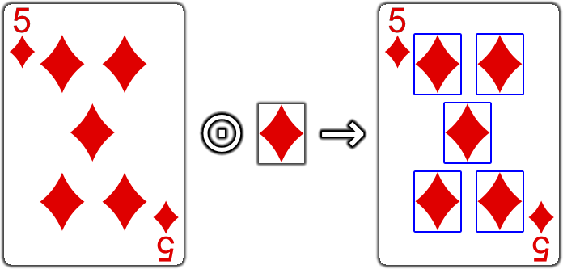

[← Home](../README.md#features)

# Artificial Intelligence Tools

> The Artificial Intelligence module enhances your library with advanced capabilities, now including OCR (Optical Character Recognition) and Image Template Matching. Effortlessly extract text from images and identify patterns or predefined templates to improve automation and streamline data processing workflows.

## 1. Optical Character Recognition (OCR)

### 1.1. Extract text from an image

```js
const Actionify = require("@lucyus/actionify");

// Extract text from an image using system default language
const text = Actionify.ai.image("/path/to/image.png").text();
// Extract text from an image using English
const text = Actionify.ai.image("/path/to/image.png").text("en");
// Extract text from an image using French
const text = Actionify.ai.image("/path/to/image.png").text("fr");
// Extract text from an image using German
const text = Actionify.ai.image("/path/to/image.png").text("de");
// Extract text from an image using Spanish
const text = Actionify.ai.image("/path/to/image.png").text("es");
// Extract text from an image using Italian
const text = Actionify.ai.image("/path/to/image.png").text("it");
// Extract text from an image using Portuguese
const text = Actionify.ai.image("/path/to/image.png").text("pt");
// Extract text from an image using Russian
const text = Actionify.ai.image("/path/to/image.png").text("ru");
// Extract text from an image using Simplified Chinese
const text = Actionify.ai.image("/path/to/image.png").text("zh-CN");
// Extract text from an image using Traditional Chinese
const text = Actionify.ai.image("/path/to/image.png").text("zh-TW");
// Extract text from an image using Japanese
const text = Actionify.ai.image("/path/to/image.png").text("ja");
// Extract text from an image using Korean
const text = Actionify.ai.image("/path/to/image.png").text("ko");
// Extract text from an image using Arabic
const text = Actionify.ai.image("/path/to/image.png").text("ar");
```

* If no text has been found, return an empty string `""`.

> You can manage your system languages in Windows Settings → Time and Language → Language.

> See also: [IETF BCP 47 Language Tags](https://en.wikipedia.org/wiki/IETF_language_tag#List_of_common_primary_language_subtags)

## 2. Image Detection



### 2.1. Locate a Sub-Image in a Larger Image

#### 2.1.1. Perfect-only matches

```js
const Actionify = require("@lucyus/actionify");

// Find regions in the image that exactly match the given sub-image
const perfectMatches = Actionify.ai
  .image("/path/to/image.png")
  .find("/path/to/sub-image.png", { minSimilarity: 1 });

// Do something with each perfect match
for (const perfectMatch of perfectMatches) {
  console.log("Perfect match found at: ", perfectMatch.position);
  console.log("Perfect match dimensions: ", perfectMatch.dimensions);
}
```

* Computation speed: **Fast**.
* `sub-image.png` **must** be a sub-region of `image.png`
* `minSimilarity` represents the minimum similarity threshold for each pixel comparison:
  * A `minSimilarity` of `1` will only return regions that are perfectly similar (i.e., a `similarity` of `1`).
  * A `minSimilarity` of `0` will return all regions, with their associated `similarity` scores ranging from `0` to `1` (essentially, this produces a [correlation map](https://en.wikipedia.org/wiki/Correlation)).
  * When omitted, `minSimilarity` defaults to `0.5`.


> See also: [MatchRegion](../src/core/types/match-region/match-region.type.ts)

#### 2.1.2. Approximate matches

```js
const Actionify = require("@lucyus/actionify");

// Find regions in the image, ranked from most to least likely to match the given sub-image
const matches = Actionify.ai
  .image("/path/to/image.png")
  .find("/path/to/sub-image.png");

// Do something with the best match
const bestMatch = matches[0];
if (bestMatch) {
  console.log("Best match found at: ", bestMatch.position);
  console.log("Best match dimensions: ", bestMatch.dimensions);
  console.log("Best match similarity with sub-image: ", bestMatch.similarity);
}
```

* Computation speed: **Moderate**.
* `sub-image.png` **must** be a sub-region of `image.png`
* `minSimilarity` represents the minimum similarity threshold for each pixel comparison:
  * A `minSimilarity` of `1` will only return regions that are perfectly similar (i.e., a `similarity` of `1`).
  * A `minSimilarity` of `0` will return all regions, with their associated `similarity` scores ranging from `0` to `1` (essentially, this produces a [correlation map](https://en.wikipedia.org/wiki/Correlation)).
  * When omitted, `minSimilarity` defaults to `0.5`.

> See also: [MatchRegion](../src/core/types/match-region/match-region.type.ts)

#### 2.1.3. All matches

```js
const Actionify = require("@lucyus/actionify");

// Find all regions in the image, ordered from most to least likely to contain the given sub-image
const allMatches = Actionify.ai
  .image("/path/to/image.png")
  .find("/path/to/sub-image.png", { minSimilarity: 0 });

// Do something with each match
for (const match of allMatches) {
  console.log("Match found at: ", match.position);
  console.log("Match dimensions: ", match.dimensions);
  console.log("Match similarity with sub-image: ", match.similarity);
}
```

* Computation speed: **Slow**.
* `sub-image.png` **must** be a sub-region of `image.png`
* `minSimilarity` represents the minimum similarity threshold for each pixel comparison:
  * A `minSimilarity` of `1` will only return regions that are perfectly similar (i.e., a `similarity` of `1`).
  * A `minSimilarity` of `0` will return all regions, with their associated `similarity` scores ranging from `0` to `1` (essentially, this produces a [correlation map](https://en.wikipedia.org/wiki/Correlation)).
  * When omitted, `minSimilarity` defaults to `0.5`.

> See also: [MatchRegion](../src/core/types/match-region/match-region.type.ts)

---

[← Home](../README.md#features)
