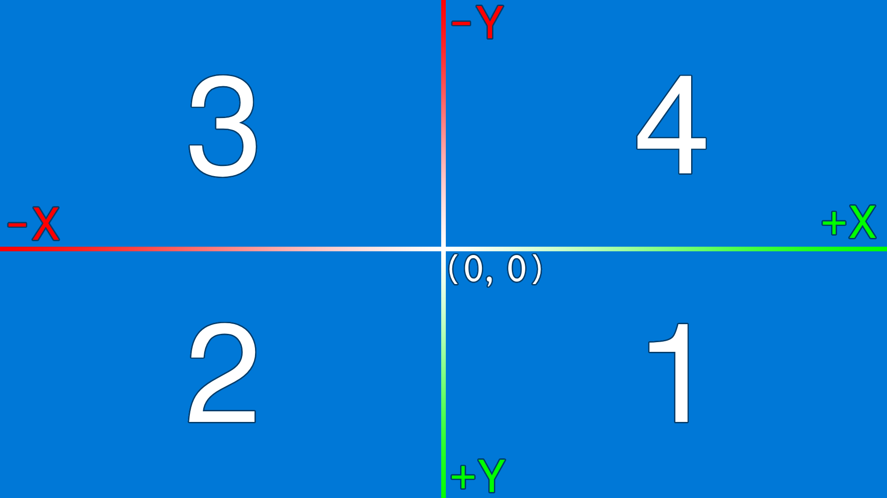

[← Home](../README.md#features)

# Screen Manager

> The Screen Manager provides tools to capture and analyze your screen effortlessly. From taking screenshots to retrieving screen details or pixel colors, it’s perfect for automation and visual processing tasks.

## 1. Screen Information

### 1.0. Screen Coordinates System



All screen-related positions are relative to the top-left corner of the main screen, which is the origin with the position (0, 0).

> The main screen is always the first one.

* Every X position right to the origin is positive.
* Every X position left to the origin is negative.
* Every Y position below the origin is positive.
* Every Y position above the origin is negative.

> You can edit your screen layout in Windows Settings → System → Display.

### 1.1. List all active screens

```js
const Actionify = require("@lucyus/actionify");

const screens = Actionify.screen.list();
```

See also: [ScreenInfo](../src/core/types/screen-info/screen-info.type.ts), [Screen Coordinates System](#10-screen-coordinates-system)

## 2. Screen Interaction

### 2.1. Take a screenshot

```js
const Actionify = require("@lucyus/actionify");

// Take a screenshot of the main monitor
const screenshotFilepath = Actionify.screen.shot();

// Take a screenshot between (100, 100) and (500, 300)
const screenshotFilepath = Actionify.screen.shot(100, 100, 400, 200);

// Take a screenshot between (100, 100) and (500, 300) and save it to a specific file
const screenshotFilepath = Actionify.screen.shot(100, 100, 400, 200, "/path/to/screenshot.png");
```

* Screenshots are saved in PNG format.
* If no file path is specified, the screenshot will be saved in the [current working directory](https://nodejs.org/api/process.html#processcwd) with the following name: `screenshot_[year]-[month]-[day]_[hour]-[minute]-[second]-[millisecond].png`

> See also: [Screen Coordinates System](#10-screen-coordinates-system)

### 2.2. Get the current color of a pixel

```js
const Actionify = require("@lucyus/actionify");

// Get the color of the pixel at the current mouse position
const color = Actionify.screen.pixel.color();

// Get the color of the pixel at position (100, 100)
const color = Actionify.screen.pixel.color(100, 100);
```

> See also: [Color](../src/core/types/color/color.type.ts)

---

[← Home](../README.md#features)
